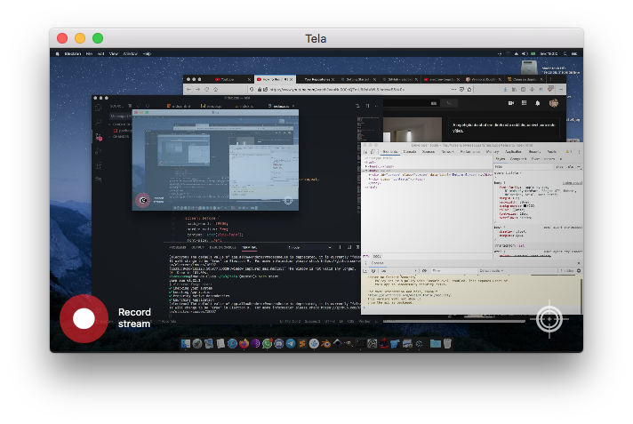
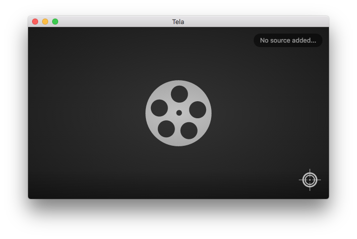

<h1 align="center">
     
    Tela
</h1>

---

## Sobre o projeto

O **Tela** é um aplicativo que grava vídeos da janela selecionada ou todo o desktop. Os vídeos são salvo em WEB-M, sem áudio, por enquanto.

---

## Tecnologias utilizadas
Esse projeto foi desenvolvido utilizando as tecnologias abaixo:

- NodeJS
- Electron

---

## Download

Versões estarão disponíveis para download em breve.